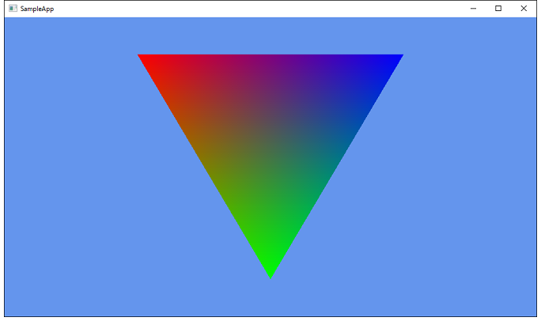

# Vulkan_Triangle
ポリゴンを描画するサンプルです。  
プログラムの解説は http://www.project-asura.com/program/vulkan/vulkan_002.html を参照してください。  
  
  
  

Licence
--------------------

This software is distributed under MIT. For details, see LICENCE file.

